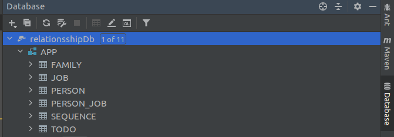
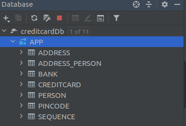

# Assignment 2

There were no problems when installing JPA

Code:

I inspected the database using IntelliJs database explorer:

Tables that were created:
* ADDRESS
* ADDRESS\_PERSON
* BANK
* CREDITCARD
* PERSON
* PINCODE

Issues:
I could not get lombok to work for a while, but later realized i had to install a lombok plugin to get it to work in the IDE.
