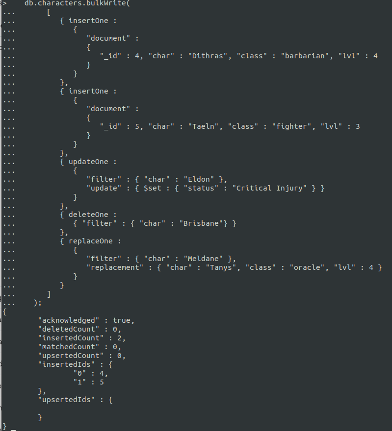

# Assignment 3

No technical problems encountered

### Validation
Using SHA256


## Experiment 1

### Insert


### Query 


### Update 


### Delete 


### Bulk write


## Experiment 2

### Tutorial example


### My own

My own function counts the number of items ordered in total, per customer. This is useful because it is now possible to see how many items the customer have bought.

#### Mapfunction
```
var mapFunction3 = function() {
   var total_items = this.items.length;
   emit(this.cust_id, total_items);
};
```

#### Reducefunction

```
var reduceFunction3 = function(keyCustId, countItems) {
  return Array.sum(countItems);
};
```

#### Mapreduce

```
db.orders.mapReduce(
   mapFunction3,
   reduceFunction3,
   { out: "map_reduce_own" }
)
```

#### Query

```
db.map_reduce_own.find().sort( { _id: 1 } )
```

##### Result


